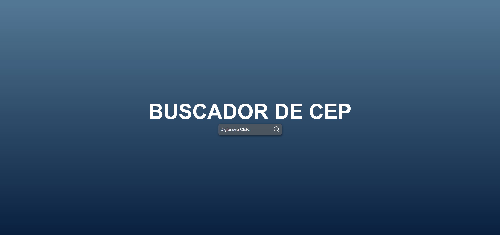
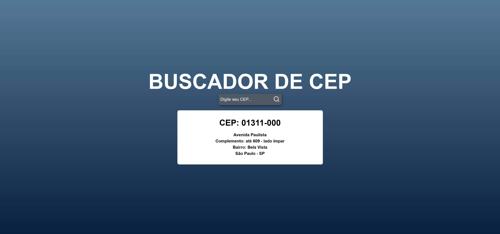

<h1 align="center"> Buscador de CEP </h1>

  <a href="#-tecnologias">Tecnologias</a>&nbsp;&nbsp;&nbsp;|&nbsp;&nbsp;&nbsp;
  <a href="#-projeto">Projeto</a>&nbsp;&nbsp;&nbsp;|&nbsp;&nbsp;&nbsp;

  

 

  

  

  
  

## 🚀 Tecnologias

Esse projeto foi desenvolvido com as seguintes tecnologias:

- HTML e CSS
- JavaScript
- ReactJS
- Node.js

## 💻 Projeto

O buscador de CEP é um componente que como o próprio nome ja diz, irá buscar o CEP que você preencher na barra de pesquisa.

## 🔗 Deploy

Acesse o projeto finalizado no link a seguir !!
[VERCEL](https://buscador-de-cep-mattbtwxd.vercel.app/)

---

Feito com ♥ by Matheus Chagas :wave:
